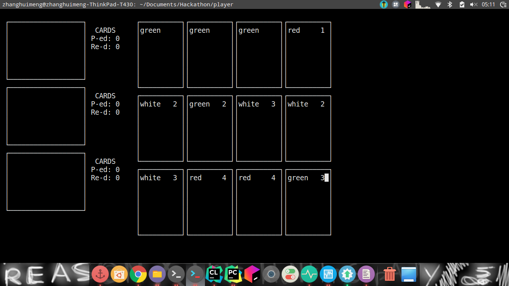

Blinking: `echo -e "SomeText \033[5;31;47mMoreText\033[0m"`
https://unix.stackexchange.com/questions/285657/create-blinking-text-with-echo-and-escape-characters

Create big xterm: `xterm -fa 'Monospace' -fs 12 -bg Grey35 &`
https://askubuntu.com/questions/161652/how-to-change-the-default-font-size-of-xterm

看起来好像还有点希望呢……